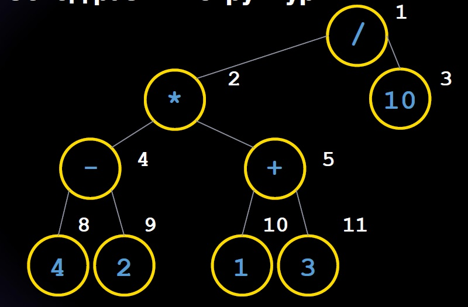

# Конспект лекций Geekbrains по языку C#

## Почему C#? 
* Язык достаточно популярный
* Используется в самых разнообразных проектах

## Основная задача курса
* Задача - научиться программированию, т.е. умению алгоритмически 
мыслить
* Конкретный язык программирования - это всего лишь инструмент, синтаксис которого можно выучить и самостоятельно

## Что такое программа?
Программа - это набор алгоритмов, принимающих на вход какие-то данные и выдающих какой-то результат

## Установка и настройка окружения 
* Скачиваем и устанавливаем VS Code (выбираем установочный файл в зависимости от операционной системы)
* Устанавливаем расширение C# для VS Code
* Может пригодиться расширение C# Extensions

## Первое приложение C# в VS Code
* Заходим в пункт меню Explorer
* Открываем папку, в которой будем реализовывать наш проект
* Открываем новый терминал (открыть папку в интегрированном терминале)
* Вводим команду **dotnet new console** (создаются все необходимые файлы для проекта)
* Открываем файл _**Program.cs**_
* По умолчанию в этом файле содержится текст: *Console.WriteLine("Hello, World!");* Это и есть наше первое приложение.

### Комментарий к коду
В коде программы можно вводить текст, который никак не используется самой программой, но позволяет программисту делать пометки (комментарии) для себя или других программистов.

В C# для комментирования используются символы **//**:

*//Пример комментария в программе C#*

### Вывод данных в окно терминала
Для вывода данных используется команда **Console.WriteLine("текст")** (в тексте программы).

### Запуск приложения
Для запуска приложения мы используем команду **dotnet run** (в терминале)

### Полезный совет - настройка автосохранения при смене фокуса

В настройках находим параметр **AutoSave** (по умолчанию off) и устанавливаем значение **onFocusChange**.

## Пример №2: запрашиваем имя пользователя и приветствуем его

**Console.ReadLine** - считываем данные и сохраняем их в переменную. 

**Console.Write** - выводим текст в терминал без перевода строки.

Пример приложения: 

    Console.WriteLine("Введите ваше имя ");
    string username = Console.ReadLine();
    Сonsole.Write("Привет,");
    Console.Write(username);

## Пример №3: складываем два числа

### Как создавать переменные в C#?
Нужно указать тип данных и название переменной.
Примеры:

    int n = 3; //целое число
    string s = "test";//строка

Пример приложения:

    int numberA = 3;
    int numberB = 5;
    int result = numberA + numberB;
    Console.WriteLine(result);

## Пример №4: деление одного числа на другое

Деление в C# осуществляется с помощью оператора **/**.

*При делении одного целого (int) числа на другое целое мы получим результат **целочисленного** деления.*

Пример:

    int numberA = 12;
    int numberB = 5;
    Console.WriteLine(numberA / numberB);// получаем 2

Чтобы получить вещественный результат деления, нам нужно указать тип переменных **double**.

Пример:

    double numberA = 12;
    double numberB = 5;
    Console.WriteLine(numberA / numberB);// получаем 2.4

## Разные типы данных занимают разный размер памяти

**bool** - тип данных для логичеких переменных

|Тип переменной | Память |
|---------------|--------|
|int|32-разрядное целое число со знаком|
|double|64-разрядное целое число со знаком|
|string|от 4 байт до 2 гб|
|bool|1 байт|

## Операторы в С#
|Оператор|Операция|
|--------|--------|
|+|Сложение|
|-|Вычитание|
|/|Деление|
|*|Умножение|
|%|Вычисление остатка|
|()|Скобки, меняем приоритет операций|

## Генерация псевдослучайных чисел

Чтобы получить псевдослучайное число в диапазоне от *min* до *max*, мы используем команду **new Random().Next(min,max+1)**

## Пример №5: сложение двух случайных чисел

    int numberA = new Random().Next(1,10);
    int numberB = new Random().Next(1,10);
    int result = numberA + numberB;
    Console.WriteLine(result);

## Пример №6: ветвление программы

Если нам нужно, чтобы программа выполнялась по разному при разных условиях, мы используем оператор **if**:

    if(условие) {
        действие 1
    } else {
        действие 2
    }

Метод **string.ToLower** переводит строку в нижний регистр:

    username.ToLower();

Пример приложения:

    Console.Write("Введите имя пользователя:");
    string username = Console.ReadLine();
    if(username.ToLower() == "маша")
    {
        Console.WriteLine("Ура, это же МАША!");
    } else {
        Console.Write("Привет, ");
        Console.WriteLine(username);
    }

## Пример №7: решение задачи с гирями

    int a = 1;
    int b = 2;
    int c = 6;
    int d = 8;
    int e = 4;

    int max = a;
    if(a > max) max = a;
    if(b > max) max = b;
    if(c > max) max = c;
    if(d > max) max = d;
    if(e > max) max = e;

    Console.Write("max = ");
    Console.WriteLine(max);

## Пример №8: задача про точки (треугольник Серпинского)

Чтобы очистить терминал можно использовать метод **Console.Clear()**.

Чтобы установить произвольную позицию курсора, можно использовать метод **Console.SetCursorPosition(столбец, строка)**

Синтаксис циклов:

    while(УСЛОВИЕ ПРОДОЛЖЕНИЯ)
    {
        Набор действий
    }

Выполняем следующий алгоритм:
1. Определить три точки
2. Выбрать две любых
3. Найти середину
4. Поставить точку
5. Выбрать случайную вершину треугольника
6. Соединить ее с полученной на 4 шаге точкой
7. Перейти к шагу 3
8. Повторить шаги 3-7

Пример приложения:

    Console.Clear()

    int xa = 1, ya = 1, xb = 1, yb = 30, xc = 40, yc = 30;

    Console.SetCursorPosition(xa,ya);
    Console.WriteLine("+");
    Console.SetCursorPosition(xb,yb);
    Console.WriteLine("+");
    Console.SetCursorPosition(xc,yc);
    Console.WriteLine("+");

    int count = 0;
    while(count < 1000) 
    {
        int what = new Random().Next(0,3);
        if (what == 0) 
        {
            x = (x+xa)/2;
            y = (y+ya)/2;
        }

        if (what == 1) 
        {
            x = (x+xb)/2;
            y = (y+yb)/2;
        }

        if (what == 2) 
        {
            x = (x+xc)/2;
            y = (y+yc)/2;
        }

        Console.SetCursorPosition(x,y);
        Console.WriteLine("+");
        count++;
    }

## Функции (методы) в C#
Функция - это часть программного кода, к которому можно обращаться несколько раз с разными параметрами (аргументами).
Функция это "коробка" в которую передаются параметры и которая выдает результат.
В C# нет обычных функций, есть только методы.

Примеры:
* Next(1,10);
* WriteLine();

**Основные элементы функции:**
* Имя (идентификатор) функции
* Входные параметры  (необязательно)
* Может возвращать значение (необязательно)

**Как выглядит функция в C#?**

    ВозвращаемыйТипДанных ИмяМетода(ТипДанных1 ИмяАргумента1,...)
    {
        ТелоМетода
        return ЗначениеСоответствующееВозвращаемомуТипуДанных;
    }

Пример функции:

    double double(x)
    {
        double result = x*x+1;
        return result;
    }

### Виды методов:
* Методы, которые ничего не принимают и ничего не возвращают
* Методы, которые принимают аргументы, но ничего не возвращают
* Методы, которые ничего не принимают, но возвращают значение
* Методы, которые принимают аргументы и возвращают значение

**Можно передавать в метод _именованные аргументы_**:

    void Message(string msg,int count)
    {
        //тело метода
    }

    Message(count:1,msg:"Сообщение");

### Задача №9: найти максимум из 9 чисел

    int Max(int arg1, int arg2, int arg3)
    {
        int result = 0;
        if (arg1 > result) result = arg1;
        if (arg2 > result) result = arg2;
        if (arg3 > result) result = arg3;
        return result;
    }

    int max1 = Max(a,b,c);
    int max2 = Max(d,e,f);
    int max3 = Max(g,h,i);
    int max = Max(max1,max2,max3);
    Console.WriteLine(max);

## Массивы 
Массив - это тип данных, в котором содержится несколько элементов по порядку. 

У каждого элемента массива есть индекс (номер, который начинается с 0);

*Как задается массив?*
* ТИП_ДАННЫХ[] имя = {значение1, значение2,..}
* int[] array = {0,1,4,2...}
* int[] array = new int[] {0,1,4,2...}
* int[] array = new int[5] {1,0,2,0,3}

*Как получить элемент массива по индексу?*
    
    int elem = array[index];

*Как получить размер массива?*

    int len = array.Length;

### Задача №10: найти максимум в массиве из 9 чисел

    int[] array = {11,21,23,32,545,23,3,2,5};
    int result = Max(
        Max(array[0],array[1],array[2]),
        Max(array[3],array[4],array[5]),
        Max(array[6],array[7],array[8])
    );
    Console.WriteLine(result);

### Задача №11: Поиск элемента в массиве

    int array[] = {1,12,31,4,15,16,17,18};
    int n = array.Length;
    int find = 4;
    int index = 0;
    while(index < n)
    {
        if (array[index] == find)
        {
            Console.WriteLine(index);
            index++;
        }
    }

### Задача №12: Заполнение массива случайными числами и вывод массива

    int array[] = new int[10];

    void FillArray(int[] collection)
    {
        int length = collection.Length;
        int index = 0;
        while(index < length)
        {
            collection[index] = new Random().Next(1,10);
            index++;
        }
    }

    void PrintArray(int[] col)
    {
        int count = col.Length;
        int position =0;
        while(position < count)
        {
            Console.WriteLine(col[position]);
            position++;
        }
    }

    FillArray(array);
    PrintArray(array);

### Задача №13: Поиск элемента в массиве с помощью метода

    int IndexOf(int[] collection,int find)
    {
        int count = collection.Length;
        int index = 0;
        int position =-1;

        while(index < count)
        {
            if(collection[index] == find)
            {
                position = index;
            }
            index++;
        }
        return position;
    }

## Циклы в C#

* While
* For
* Do While

Синтаксис цикла **for**:

    for(int i=0;i<10;i++)
    {
        Console.WriteLine(i);
    }

### Задача №14: Вывод таблицы умножения на экран

    for(int i=2;i<=10;i++)
    {
        for(int j=2; j<=10;j++)
        {
            Console.WriteLine($"{i}X{j}={i*j}")
        }
        Console.WriteLine();
    }

### Задача №15: Заменить символы в строке

    string text = "— Я думаю, — сказал князь, улыбаясь, — что,"
    + "ежели бы вас послали вместо нашего милого "
    + "Винценгероде, вы бы взяли приступом согласие " 
    + "прусского короля. Вы так красноречивы. Вы "
    + "дадите мне чаю?";

    string Replace(string text, char oldValue,char newValue)
    {
        string result = String.Empty;
        int length = text.Length;
        for(int i=0;i<length;i++)
        {
            if(text[i] == oldValue) result += $"{newValue}";
            else result = result + $"{text[i]}";
        }
        return result;
    }

    string new_text = Replace(text," ","|");

### Задача №16: сортировка массива

    int[] arr = {1,5,4,3,2,1,4,5}

    void SelectionSort(int[] array)
    {
        for(int i=0;i<array.Length;i++)
        {
            int minPosition = i;
            for(int j=i+1;j<length;j++)
            {
                if(array[i] < array[minPosition]) minPosition = j;
            }            
            int temp = array[i];
            array[i] = array[minPosition];
            array[minPosition] = temp;
        }
    }

## Двумерные (многомерные) массивы

**Как задаются двумерные массивы?**

    НазваниеТипа[,] НазваниеМассива = new НазваниеТипа[количество_строк, количество_столбцов]
    
    string[,] table = new string[2,3];

    int[,] matrix = new int[5,8]

**Как обратиться к нужному элементу массива?**

    table[1,2] - элемент в 1 строке, во втором столбце

### Задача №17: Распечатать элементы массива (знаем количество строк и столбцов)

    string[,] table = new string[2,5];
    table[1,2] = "слово";
    for(int rows = 0;rows<2,rows++)
    {
        for(int columns = 0; columns <5; columns++)
        {
            Console.WriteLine($"{table[rows,columns]}");
        }
    }
    //будет выведено только одно значение "слово", т.к. все остальные элементы массива инициализированы, как пустые строки

    int[,] matrix = new int[3, 4];
    for (int i = 0; i < 3; i++)
    {
        for (int j = 0; j < 4; j++)
        {
            Console.WriteLine($"{matrix[i, j]} ");
        }
    }
    //будет выведен список нулей

    //попробуем сделать так, чтобы это была таблица нулей
    int[,] matrix = new int[3, 4];
    for (int i = 0; i < 3; i++)
    {
        for (int j = 0; j < 4; j++)
        {
            Console.Write($"{matrix[i, j]} ");
        }
        Console.WriteLine();
    }

### Задача №18: Распечатать элементы массива (количество строк и столбцов неизвестно)

Чтобы получить количество строк и столбцов, мы можем использовать метод *array.GetLength*:
* Количество строк - *array.GetLength(0)*
* Количество столбцов - *array.GetLength(1)*

Код:

    int[,] matrix = new int[3, 4];
    for (int i = 0; i < matrix.GetLength(0); i++)
    {
        for (int j = 0; j < matrix.GetLength(1); j++)
        {
            Console.Write($"{matrix[i, j]} ");
        }
        Console.WriteLine();
    }

### Задача №19: Заполнение матрицы случайными числами

    void FillArray(int[,] matr)
    {
        for (int i = 0; i < matr.GetLength(0); i++)
        {
            for (int j = 0; j < matr.GetLength(1); j++)
            {
                matr[i,j] = new Random().Next(1,10);//[1; 10)
            }
        }
    }

## Рекурсия

Если метод вызывает сам себя, то это называется **рекурсия**.

### Задача №20: Пример решения задачи с рекурсией

Имеем двумерный массив из нулей и единиц:

    int[,] pic = new int[,]
    {
        {0, 0, 0, 0, 0, 0, 0, 0, 0, 0, 0, 0, 0, 0, 0, 0, 0, 0, 0, 0, 0, 0, 0, 0, 0 },
        {0, 0, 0, 0, 0, 0, 0, 0, 0, 0, 0, 0, 1, 1, 0, 0, 0, 0, 0, 0, 0, 0, 0, 0, 0 },
        {0, 0, 0, 0, 0, 0, 0, 0, 0, 0, 0, 1, 0, 0, 1, 0, 0, 0, 0, 0, 0, 0, 0, 0, 0 },
        {0, 0, 0, 0, 0, 0, 0, 0, 0, 0, 0, 1, 0, 0, 1, 0, 0, 0, 0, 0, 0, 0, 0, 0, 0 },
        {0, 0, 0, 0, 0, 0, 0, 0, 0, 0, 1, 0, 0, 0, 1, 0, 0, 0, 0, 0, 0, 0, 0, 0, 0 },
        {0, 0, 0, 0, 0, 0, 0, 0, 0, 0, 1, 0, 0, 0, 1, 0, 0, 0, 0, 0, 0, 0, 0, 0, 0 },
        {0, 0, 0, 0, 0, 0, 0, 0, 0, 1, 0, 0, 0, 1, 0, 0, 0, 0, 0, 0, 0, 0, 0, 0, 0 },
        {0, 0, 0, 0, 0, 0, 0, 1, 1, 0, 0, 0, 0, 1, 0, 0, 0, 0, 0, 0, 0, 0, 0, 0, 0 },
        {0, 0, 0, 0, 0, 1, 1, 0, 0, 0, 0, 0, 1, 0, 0, 0, 0, 0, 0, 0, 0, 0, 0, 0, 0 },
        {0, 0, 1, 1, 1, 0, 0, 0, 0, 0, 0, 1, 1, 1, 1, 1, 1, 1, 1, 1, 1, 0, 0, 0, 0 },
        {0, 0, 1, 0, 0, 0, 0, 0, 0, 0, 0, 0, 0, 0, 0, 0, 0, 0, 0, 0, 0, 1, 0, 0, 0 },
        {0, 0, 1, 0, 0, 0, 0, 0, 0, 0, 0, 0, 0, 0, 0, 0, 0, 0, 0, 0, 0, 1, 0, 0, 0 },
        {0, 0, 1, 0, 0, 0, 0, 0, 0, 0, 0, 0, 0, 0, 0, 0, 1, 1, 1, 1, 1, 0, 0, 0, 0 },
        {0, 0, 1, 0, 0, 0, 0, 0, 0, 0, 0, 0, 0, 0, 0, 0, 0, 0, 0, 0, 0, 1, 0, 0, 0 },
        {0, 0, 1, 0, 0, 0, 0, 0, 0, 0, 0, 0, 0, 0, 0, 0, 0, 0, 0, 0, 0, 1, 0, 0, 0 },
        {0, 0, 1, 0, 0, 0, 0, 0, 0, 0, 0, 0, 0, 0, 0, 0, 1, 1, 1, 1, 1, 0, 0, 0, 0 },
        {0, 0, 1, 0, 0, 0, 0, 0, 0, 0, 0, 0, 0, 0, 0, 0, 0, 0, 0, 0, 1, 0, 0, 0, 0 },
        {0, 0, 1, 0, 0, 0, 0, 0, 0, 0, 0, 0, 0, 0, 0, 0, 0, 0, 0, 0, 1, 0, 0, 0, 0 },
        {0, 0, 1, 0, 0, 0, 0, 0, 0, 0, 0, 0, 0, 0, 0, 1, 1, 1, 1, 1, 0, 0, 0, 0, 0 },
        {0, 0, 1, 1, 1, 1, 1, 0, 0, 0, 0, 0, 0, 0, 0, 0, 0, 0, 0, 1, 0, 0, 0, 0, 0 },
        {0, 0, 0, 0, 0, 0, 0, 1, 1, 1, 1, 0, 0, 0, 0, 0, 0, 0, 1, 0, 0, 0, 0, 0, 0 },
        {0, 0, 0, 0, 0, 0, 0, 0, 0, 0, 0, 1, 1, 1, 1, 1, 1, 1, 0, 0, 0, 0, 0, 0, 0 },
        {0, 0, 0, 0, 0, 0, 0, 0, 0, 0, 0, 0, 0, 0, 0, 0, 0, 0, 0, 0, 0, 0, 0, 0, 0 },
    };

Если 0 будет означать незакрашенный пиксель, а 1 - закрашенный, то мы этот массив будет представлять картинку - контур фигуры (большой палец вверх).

    void PrintImage(int[,] image)
    {
        for (int i = 0; i < image.GetLength(0); i++)
        {
            for (int j = 0; j < image.GetLength(1); j++)
            {
                if(image[i,j] == 0) Console.Write($" ");
                else Console.Write($"+");
            }
            Console.WriteLine();
        }
    }
    PrintImage(pic);

**Задача:** написать метод, который будет закрашивать этот контур.

**Алгоритм будет следующий:**
* Берем любую точку внутри контура и определяем правило обхода - сначала идем вверх, потом влево, потом вних и вправо.
* Смотрим на точку выше и, если она не закрашена, то красим.
* Опять смотрим на точку выше, и опять закрашиваем. И так, пока не встретим закрашенную точку.
* Смотрим на точку слева, если она не закрашена, то красим. Опять двигаемся теперь в левом направлении, пока не попадем снова на контур.
* Меняем направление - теперь двигаемся вниз, пока не наткнемся на закрашенную точку
* Меняем направлением - теперь двигаемся вправо, пока не наткнемся на закрашенную точку.

**Опишем формально эти шаги**:
Если мы находимся в текущей точке с координатами *x*, *y*, движение будет выглядеть так:

|     |     |вверх|     ||
|---- |-----|-----|-----|----|
|     |     |x-1,y|     ||
|**влево**|x,y-1|x,y  |x,y+1|**вправо**|
|     |     |x+1,y|     ||
|     |     |**вниз**|      ||

**Код**:

    void FillImage(int row,int col)
    {
        if(pic[row,col] == 0)
        {
            pic[row,col] = 1;
            FillImage(row-1,col);
            FillImage(row,col-1);
            FillImage(row+1,col);
            FillImage(row,col+1);
        }
    }

### Задача №21: Вычисление факториала

    int Factorial(int n)
    {
        if(n==1) return 1;
        else return n * Factorial(n-1);
    }

    Console.WriteLine(Factorial(3));

Если попробовать вычислить факториал от достаточно большого числа (например, 40), то в какой-то момент мы начнем получать отрицательные числа. Это **переполнение типа** - т.к. получаемое число больше, чем может иметь тип данных integer.

Чтобы решить эту проблему, можно заменить тип на double.

    double Factorial(int n)
    {
        if(n==1) return 1;
        else return n * Factorial(n-1);
    }

    Console.WriteLine(Factorial(3));

### Задача №22: Вычисление чисел Фибоначчи

    double Fibonacci(int n)
    {
        if(n == 1 || n == 2) return 1;
        else return Fibonacci(n-1) + Fibonacci(n-2);
    }

## Правила понятного кода

### Общие правила

* Код чаще читается, чем пишется:  не нужно жертвовать понятностью кода ради скорости;
* Не нужно использовать сокращения, кроме общепринятых;
* Нельзя использовать для названий зарезервированные слова (в используемом языке программирования)
* Нужно писать только на латинице и избегать сложных слов
* Не использовать нецензурные слова даже в комментариях

### Названия переменных

* Нужно выбирать такие имена для переменных, которые легче читаются
* Избегайте непонятных отсылок
* Не стоит использовать символы, кроме букв и цифр
* Нельзя использовать названия, которые совпадают с ключевыми словами популярных языков программирования
* По возможности не сокращать
* Лучше использовать общие, не привязанные к контексту имена (напрмер value вместо str)
* Именования методов аргументов, переменных и т.п. отличается

### Нотации

* PascalCase (оба слова с заглавной буквы)
* CamelCase (первая буква первого слова - строчная)

### Форматирование кода

* Избегайте длинных строк (это нечитаемо)
* Используйте форматирование, отступы
* Упрощайте код
* Используйте возможности языка, они могут сократить код

### Проверка на отрицание

Не используйте проверку вида "логическое значение == false", используйте 
    
    !логическое_значение

### Красивый код

* Для методов используйте нотацию Pascal
* Асинхронные методы помечайте словом Async: GetStreamAsync()
* Для переменных используйте нотацию Camel
* При прочих равных лучше не использовать неявную типизацию (var)
* Объявляйте переменную перед тем, как использовать
* Не нужно придумывать сложные имена переменных-счетчиков, i,j,k - все поймут
* Инициализируйте переменные при объявлении, если есть такая возможность
* Не используйте длинные цепочки вызовов
* Данные одного типа должны находиться в коде рядом

### Комментарии и документирование

* Внутри блока с кодом нужно отделять комментарий одним пробелом

Пример: 
    
    // Комментарий

* Неиспользуемый код нужно не комментировать, а удалять. Если это временное комментирование, то нужно делать пометку "TODO: причина"

## Дополнительная лекция о рекурсии

**Что самое важное при написании рекурсивной функции?**
Прописать условия, при которых функция перестанет сама себя вызывать (условия выхода из рекурсии).

Если рекурсия неконтролируемая:
* Система работает очень медленно
* Программа висит
* Используется очень много ресурсов

### Задача №23: Собираем строку с числами от a до b (a <= b) 

**Решение:**

    string NumbersRec (int a, int b)
    {
        if (a<=b) return $"{a} " + NumbersRec(a+1,b);
        else return String.Empty;
    }

### Задача №24: Сумма чисел от 1 до n

**Решение:**

    int SumRec (int n)
    {
        if (n==0) return 0;
        else return n + SumRec(n-1);
    }

### Задача №25: Вычисляем 𝑎 в степени n

**Решение:**

    int PowerRec (int a, int n)
    {
        if (n==0) return 1;
        else return PowerRec(a,n-1)*a;
    }

**Примечание:** в С# существует _тернарный оператор_:
    
    return n == 0?1:PowerRec(a,n-1)*a;

**Улучшенное решение:**

    int PowerRecMath (int a, int n)
    {
        if (n==0) return 1;
        else if (n%2 == 0) return PowerRecMath(a*a,n/2);
        else return PowerRec(a,n-1)*a;
    }

### Задача №26:Перебор слов
Пусть у нас будет некоторый алфавит, состоящий из четырёх букв, и нас просят показать все возможные слова, cостоящие из T букв. Т может равняться 1, 2, 3 и так далее. Решить эту задачу в общем виде, если наперёд неизвестно Т (сколько букв должно быть в словах)

**Решение:**

    void FindWords (string alphabet, char[]  word, int length = 0)
    {
        if (length == word.Length) 
        {
            Console.WriteLine($"{n++} {new String(word)}"); 
            return;
        }
        for(int i=0;i< alphabet.Length;i++)
        {
            word[length] = alphabet[i];
            FindWords(alphabet,word,,length + 1);
        }
    }

    FindWords("аисв", new char[5]);

### Задача №27: Просмотр содержимого папки файлов (обход директории)

**Решение:**

    string path = "...";
    void CatalogInfo(string path,string indent = "")
    {
        DirectoryInfo catalog = new DirectoryInfo(path);
        DirectoryInfo[] catalogs = catalog.GetDirectories();
        for(int i = 0; i < catalog.Length; i++)
        {
            Console.WriteLine($"{indent}{catalogs[i].Name}");
            CatalogInfo(catalogs[i].FullName, indent + "    ");
        }

        FileInfo[] files = catalog.GetFiles();
        for(int i=0;i< files.Length;i++)
        {
            Console.WriteLine($"{indent}{files[i].Name}");
        }
    }

    CatalogInfo(path);

### Задача №28: Игра в ханойские башни
У нас есть некоторая башенка с определённым количеством блинчиков и шпилей. Далее мы должны переместить нужный блин на третий шпиль. УНа следующем этапе можем взять, например, четыре блина, пять и так далее.  

Чем больше блинов, тем дольше будет идти игра и тем она сложнее (проще запутаться). Решим задачу с помощью рекурсии.

Мы должны с 1 шпиля переместить блины на 3, а с 1 — на 2. Соответственно, с 1 — на 3, с1 — на 2. Дальше с 3 — на 2, с 1 — на 3. С 3 — на 2, с 1 — на 3, далее со 2 — на 1, со 2 — на 3. Со 2
— на 1, со 2 — на 3. И далее с 1 — на 3. 

**Решение:**

void Towers(string with = "1",string on = "3", string some = "2",int count = 3)
{
    if(count > 1) Towers(with,some,on, count - 1);
    Console.WriteLine($"{with} >> {on}");
    if(count > 1) Towers(some, on, with, count-1);
}

### Задача №28: Обход разных структур
Допустим, есть арифметическое выражение

    ((4-2) * (1+3)) / 10

Мы на основе этого выражения можем построить *бинарное дерево*:

Мы можем представить это дерево в виде одномерного массива:

    string[] tree = {emp, "/", "*" ,"10","-","+",emp,emp,"4","2","1","3"};
    //                0    1    2     3   4   5   6   7   8   9   10  11

**Решение:**

    void InOrderTraversal(int pos = 1)
    {
        if(pos < tree.Length)
        {
            int left = 2 * pos;
            int right = 2 * pos + 1;
            if(left < tree.Length && !String.isNullOrEmpty(tree[left])) InOrderTraversal(left);
            Console.WriteLine(tree[pos]);
            if(right < tree.Length && !String.isNullOrEmpty(tree[right])) InOrderTraversal(right);
        }
    }