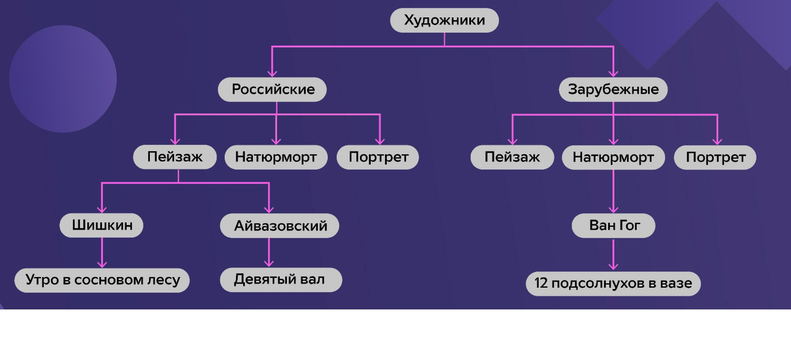
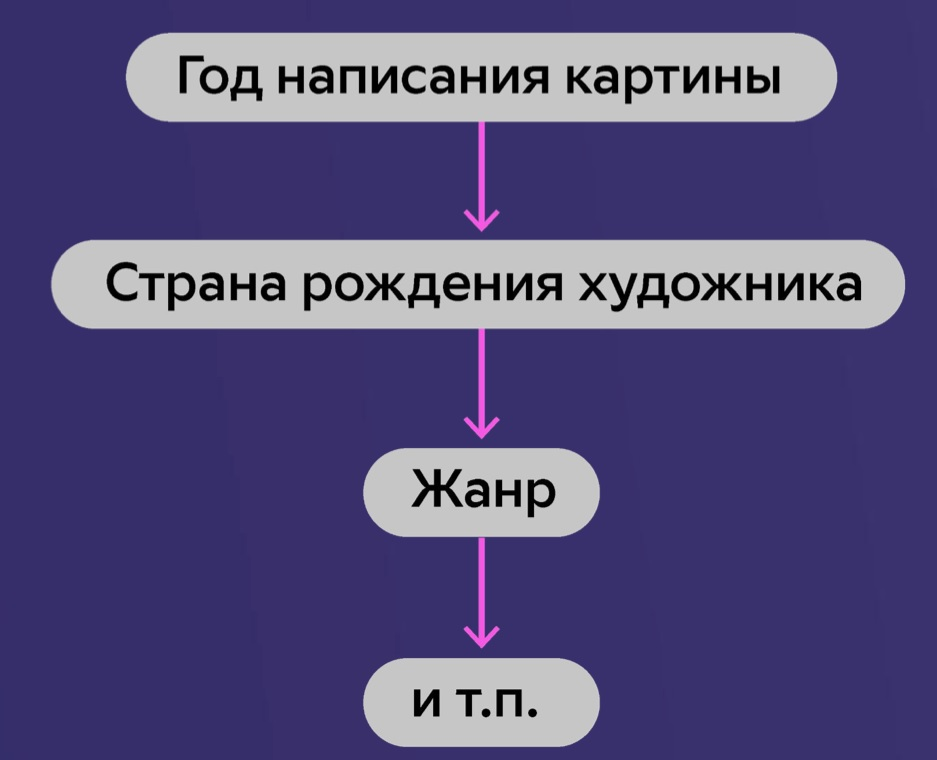
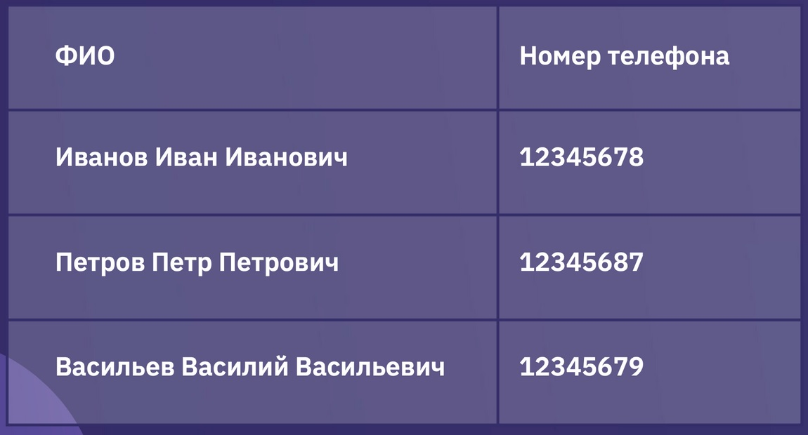
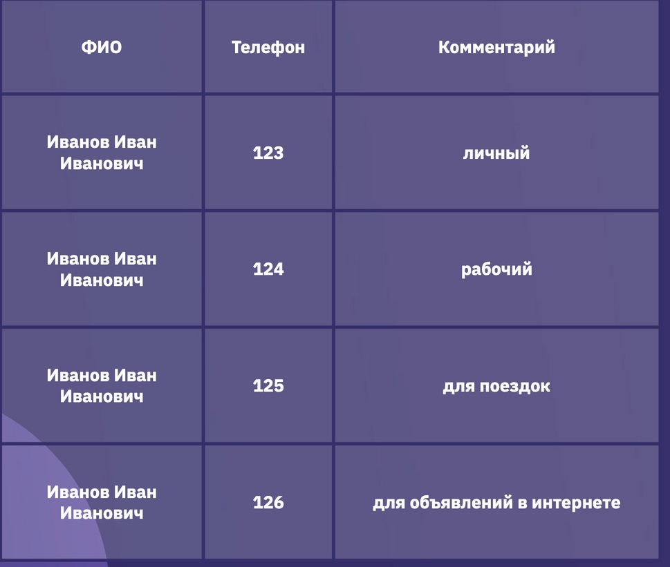

# Знакомство с базами данных

## Что такое база данных

База данных - это концепция, система управления базами данных (СУБД) - это инструмент. На этом курсе основное внимание будет уделено именно концепции "Базы данных".

Примеры баз данных:
* Картотека
* Результаты переписки населения
* Библиотеки
* Книги учета 

База данных - это инструмент хранения, обработки и быстрого извлечения необходимой информации.

## Иерархические базы данных

**Пример задачи:** необходимо составить базу данных для картинной галереи, позволяющую найти картину определенного автора и жанра.

**Пример решения №1**: 
Разделяем худоников на российских и зарубежных, далее разделяем по стилям, далее - по именам и названиям картин.

**Пример иерархической базы данных:**

**Минусы такого подхода:**
* Если у картины несколько авторов, то часть информации потеряется. Чтобы получить всех авторов, то нужно будет пробежаться по всем художникам и проверить, есть ли у них такая картина.
* То же самое, если один автор писал в нескольких жанрах:  в этом случае при поиске всех картин нужно будет просмотреть все жанры.

*При создании иерархической базы данных мы с самого начала фиксируем сценарий использования этой базы.* В случае иерархической базы данных будет удобно находить все картины российских художников или конкретный жанр картин российских художников. 

### Задача №1: Написать иерархическую структуру, которая позволила бы из всего набора картин находить те, которые были написаны во второй половине 19го века.

**Решение:** Начать каталог с года написания картины, далее - страна рождения художника, далее - жанр и т.п.

**_Главная проблема иерархической структуры - ее негибкость._**

## Реляционные базы данных

**Пример задачи:** необходимо создать собственный телефонный справочник (используя электронные таблицы).

**Пример решения**: 
Разделяем худоников на российских и зарубежных, далее разделяем по стилям, далее - по именам и названиям картин.

**Решение №1**: делаем два столбца, в одном - ФИО, в другом - номер телефона.

**Недостатки этого решения:**
* У человека может быть несколько номеров телефона (можно добавить столбик "дополнительный номер телефона"). Но в случае добавления столбца для доп. номера у нас появится другая проблема - пустые ячейки, кроме того, количество доп. номером может быть разным у разных людей.

**Решение №2**: делаем три столбца - ФИО, телефон и комментарий. Каждый человек может занимать две и более строк, в зависимости от того, сколько у него номеров.

**Недостатки этого решения:**
* Дублирование информации. В самом простом примере дублируется ФИО, но кроме этого в базе данных может храниться адрес, дата рождения и т.п.
* Если у нас хранится адрес и этот адрес меняется, то его придется менять в каждой строке
* Большой объем данных

**Решение №3**: делаем две таблицы, основную таблицу, в которой хранятся ФИО и другие данные, и дополнительную таблицу с телефонами.

*Основная таблица:*
|ФИО|Адрес|Дата рождения|Статус|
|---|-----|-------------|------|
|Иванов И.И.|Казань|12.02.1990|женат|
|Петров П.П.|Москва|23.04.1983|холост|

*Дополнительная таблица:*
|Чей телефон|Телефон|Комментарий|
|-----------|-------|-----------|
|Иванов И.И.|123|личный|
|Иванов И.И.|124|рабочий|
|Петров П.П.|234|личный|

**Плюсы этого решения**:
* База данных занимает меньше места
* Расширенная информация по человеку хранится в основной таблице, одна строка соответствует одному человеку
* Для телефонов - дополнительная таблица

**Проблемы этого решения:**
Люди с одинаковыми ФИО неразличимы, в дополнительной таблице нет инфомрации, по которым их можно было бы различить.

**Решение №4**: Добавляем столбик с уникальным идентификатором человека, по этому идентификатору связываем таблицы между собой.

*Основная таблица:*
|ID|ФИО|Адрес|Дата рождения|Статус|
|--|---|-----|-------------|------|
|1|Иванов И.И.|Казань|12.02.1990|женат|
|2|Петров П.П.|Москва|23.04.1983|холост|

*Дополнительная таблица:*
|Чей телефон|Телефон|Комментарий|
|-----------|-------|-----------|
|1|123|личный|
|1|124|рабочий|
|2|234|личный|

Уникальный идентификатор из основной таблицы - это *первичный ключ*, а этот же идентификатор в дополнительной таблице - *внешний ключ*.

**Первичный ключ** — ID, уникальная информация, которая позволяет идентифицировать каждую конкретную запись таблицы.
Внешний ключ — ID из дополнительной таблицы (уже не уникальный). Позволяет найти информацию из основной таблицы.

**Реляционные базы данных** — базы данных, в которых данные распределены по отдельным, но связанным между собой таблицам.